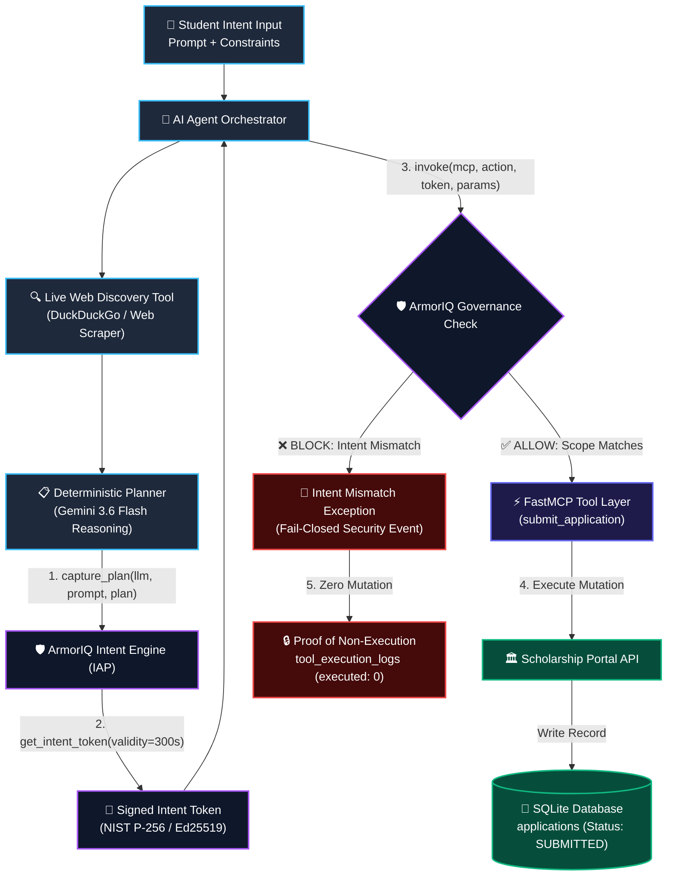

# ScholarShield — Intent-Governed Autonomous Scholarship Application Agent

[](https://scholar-shield.zopcloud.zop.dev)
[](https://armoriq.ai)
[](https://python.org)
[](https://modelcontextprotocol.io)
[](LICENSE)

> **Automate India Hackathon — ArmorIQ Track Submission**  
> *Core Engineering Principle: AI should be autonomous in execution, but not autonomous in authority.*

---

## 🌐 Live Cloud Deployment

| Resource | URL |
| :--- | :--- |
| **Live Web Dashboard** | **[https://scholar-shield.zopcloud.zop.dev](https://scholar-shield.zopcloud.zop.dev)** |
| **API Health Endpoint** | `https://scholar-shield.zopcloud.zop.dev/health` |
| **Proof of Non-Execution API** | `https://scholar-shield.zopcloud.zop.dev/api/proof-of-non-execution` |
| **Audit Logs Stream** | `https://scholar-shield.zopcloud.zop.dev/api/audit-logs` |
| **Submission Dossier** | [`docs/SUBMISSION.md`](docs/SUBMISSION.md) |

---

## 📌 Executive Summary

**ScholarShield** is an intent-governed autonomous scholarship discovery and application agent. It automates scholarship discovery, eligibility verification, document drafting, and application submission across government and institutional portals.

While state-of-the-art LLMs can reason and plan, **unconstrained AI autonomy leads to an authority crisis**: an agent given permission to *"apply for government engineering scholarships in Punjab"* might independently decide to apply for an unauthorized private grant, or share sensitive student PII with out-of-scope portals.

ScholarShield solves this by embedding the **ArmorIQ Intent Assurance Platform (IAP)** and **FastMCP tool boundaries** directly into the agent's execution path. Before any consequential mutation or form submission occurs, ArmorIQ cryptographically validates intent tokens, deterministically enforcing user constraints and providing **mathematical Proof of Non-Execution** when out-of-scope actions are attempted.

---

## 🎯 The Authority Crisis in Autonomous AI

```
┌─────────────────────────────────────────────────────────────────────────────┐
│                           THE AUTHORITY CRISIS                              │
│                                                                             │
│  User Intent: "Find & apply for government scholarships in Punjab"           │
│                                                                             │
│  Traditional Agent:  "I found a private loan/grant with higher aid.        │
│                      Applying now to maximize student funding..."          │
│                      ❌ UNAUTHORIZED MUTATION / DATA EXFILTRATION           │
│                                                                             │
│  ScholarShield:      "ArmorIQ IAP Interception: Target SCH-PRV violates     │
│                      scope (scholarship_type: government).                 │
│                      Action BLOCKED. Tool non-execution guaranteed (0)."    │
│                      ✅ CRYPTOGRAPHIC INTENT BOUNDARY PRESERVED             │
└─────────────────────────────────────────────────────────────────────────────┘
```

Agents can reason freely, but **they cannot manufacture authority**. ScholarShield decouples execution autonomy from authority governance.

---

## 🛡️ High-Level System Architecture



---

## 🔄 The 13-Stage Autonomous Workflow

ScholarShield operates across a resilient 13-stage pipeline that ensures intent integrity from initial prompt parsing to final verification:

```
[ Stage 01: Student Intent Intake ]
                 │
[ Stage 02: Dynamic Web Discovery ]
                 │
[ Stage 03: Opportunity Candidate Selection ]
                 │
[ Stage 04: Structured Execution Planning ]
                 │
[ Stage 05: ArmorIQ IAP Plan Capture ]
                 │
[ Stage 06: Cryptographic Token Minting ]
                 │
[ Stage 07: Governed Execution Phase ]
                 │
[ Stage 08: FastMCP Discovery Execution ]
                 │
[ Stage 09: Multi-Factor Eligibility Check ]
                 │
[ Stage 10: Application Package Drafting ]
                 │
[ Stage 11: ArmorIQ Governance Gate ]
         ┌───────┴───────┐
   (Scope Valid)   (Scope Drift / Attack)
         ▼               ▼
[ Stage 12: Consequential ] [ Stage 13: Proof of   ]
[ FastMCP Submission     ] [ Non-Execution Audit ]
```

### Workflow Stage Breakdown:
1. **Student Intent Intake**: Student provides natural language requirements (`raw_prompt`), academic state, field of study, income bracket, and category.
2. **Dynamic Web Discovery**: Agent executes real-time web discovery (`LiveWebScholarshipSearchTool`) prior to plan lock-in to surface current government schemes.
3. **Opportunity Candidate Selection**: Filters opportunities against eligibility criteria (domicile state, maximum income threshold, academic branch).
4. **Structured Execution Planning**: Generates deterministic `ExecutionPlan` with designated steps, inputs, and constraints (augmented by optional **Gemini 3.6 Flash** reasoning).
5. **ArmorIQ IAP Plan Capture**: `armoriq.capture_plan()` registers the plan, LLM model identifier, raw prompt, and action sequence with the ArmorIQ Intent Engine.
6. **Cryptographic Token Minting**: ArmorIQ issues a signed `IntentToken` containing cryptographic plan hashes and a 300-second time-to-live (TTL).
7. **Governed Execution Phase**: Orchestrator initiates sequential execution of plan steps through tool boundary.
8. **FastMCP Discovery Execution**: Invokes `search_scholarships` via FastMCP boundary to confirm portal scheme parameters.
9. **Multi-Factor Eligibility Check**: Invokes `check_eligibility` to evaluate CGPA, income ceiling, state domicile, and mandatory documentation.
10. **Application Package Drafting**: Invokes `prepare_application` to generate a draft application package and document bundle.
11. **ArmorIQ Governance Interception Gate**: Prior to the consequential mutation, `armoriq.invoke()` verifies parameters against signed intent token bounds.
12. **Consequential FastMCP Submission (Happy Path)**: Upon ArmorIQ `ALLOW`, `submit_application` submits the form and writes a `SUBMITTED` record to the database.
13. **Proof of Non-Execution Audit (Attack / Drift Path)**: If out-of-scope parameters are detected (e.g. private grant injection), ArmorIQ returns `BLOCK`. Downstream tool execution is aborted, database submissions remain strictly **0**, and security audit logs record non-execution.

---

## 🔐 ArmorIQ Intent Assurance Platform (IAP) Integration

ScholarShield implements the production `armoriq-sdk` integration lifecycle:

### 1. Plan Capture (`capture_plan`)
```python
captured_plan = armoriq_client.capture_plan(
    llm="gemini-3.6-flash",
    prompt=intent.raw_prompt,
    plan={
        "goal": f"Apply for {intent.scholarship_type} scholarships in {intent.target_state}",
        "constraints": {
            "scholarship_type": intent.scholarship_type,
            "target_state": intent.target_state,
            "target_field": intent.target_field,
        },
        "steps": [
            {"action": "search_scholarships", "mcp": "scholarship", "params": {...}},
            {"action": "check_eligibility", "mcp": "scholarship", "params": {...}},
            {"action": "prepare_application", "mcp": "scholarship", "params": {...}},
            {"action": "submit_application", "mcp": "scholarship", "params": {...}}
        ]
    }
)
```

### 2. Cryptographic Intent Token Issuance (`get_intent_token`)
```python
intent_token = armoriq_client.get_intent_token(
    captured_plan,
    validity_seconds=300
)
```
- **Signatures Supported**: NIST P-256 (SECP256R1) ECDSA and Ed25519.
- **Payload Invariants**: Plan hash, expiration timestamp, policy scope constraints, client identity.

### 3. Governed Action Execution (`invoke`)
```python
governance_result = armoriq_client.invoke(
    mcp="scholarship",
    action="submit_application",
    intent_token=intent_token,
    params=step_inputs,
    user_email=f"{intent.user_id}@scholarshield.local"
)

if governance_result.get("decision") != "ALLOW":
    # Fail-closed: Protected action is NEVER executed
    raise IntentMismatchException(governance_result.get("error"))
```

---

## ⚡ FastMCP Tool Architecture & Boundaries

ScholarShield isolates AI reasoning from side-effecting operations via the **Model Context Protocol (MCP)**:

| FastMCP Tool | Type | Security Classification | Governance Requirement |
| :--- | :--- | :--- | :--- |
| `search_scholarships` | Read / Discovery | Safe / Non-Mutating | Intent Policy Verified |
| `get_scholarship_details` | Read / Metadata | Safe / Non-Mutating | Publicly Accessible |
| `check_eligibility` | Read / Verification | Safe / Non-Mutating | Domicile & Income Audit |
| `prepare_application` | Write / Draft | Low-Risk Mutation | Student ID & Scope Matched |
| `submit_application` | **Consequential Write** | **Critical Mutation** | **Cryptographic Intent Token + Explicit ArmorIQ ALLOW** |

### Defense-in-Depth at Tool Layer
Even if an orchestrator attempts to bypass governance, the `ScholarshipMCPTools.submit_application` tool implements internal defense-in-depth:
```python
if armoriq_decision != "ALLOW":
    raise PermissionError("Protected action denied: orchestrator did not receive ALLOW from ArmorIQ.")
```

---

## 🔒 Proof of Non-Execution

A core benchmark of the ArmorIQ Track is proving that unauthorized actions **physically never execute** on downstream APIs or databases.

When an intentional intent drift is simulated (e.g. attempting to submit to private grant `SCH-PRV-GLOBAL-03`):
1. **ArmorIQ Gate Decision**: Returns `BLOCK` (`IntentMismatchException`).
2. **Orchestrator State**: Step marked `BLOCKED`, `executed = False`, `protected_action_executed = False`.
3. **Mock Portal State**: `tool_execution_logs` records `armoriq_decision = BLOCK`, `executed = 0`.
4. **Database Invariant**: Application submission count for `SCH-PRV-GLOBAL-03` in `applications` table is strictly **`0`**.

Verify live at: `https://scholar-shield.zopcloud.zop.dev/api/proof-of-non-execution`

---

## 🧑‍⚖️ Step-by-Step Judge Evaluation Guide

### Option A: Interactive Web UI Evaluation (Recommended)
Navigate to the live URL: **[https://scholar-shield.zopcloud.zop.dev](https://scholar-shield.zopcloud.zop.dev)**

#### Scenario 1: Authorized Happy Path (Government Scholarship)
1. In the **Student Intent Parameters** card:
   - Select **Target State**: `Punjab`
   - Select **Scholarship Type**: `Government`
   - Ensure checkboxes under *Simulate Security / Edge Scenarios* are **unchecked**.
2. Click **🚀 Run Autonomous Agent**.
3. **Verify Output**:
   - ArmorIQ Intent Token is generated with signed status.
   - All 4 workflow steps display `SUCCESS` with `ALLOW` badge.
   - Live portal shows Application Status: `SUBMITTED` with database record created.

#### Scenario 2: ArmorIQ Defense against Scope Drift / Attack (Intent Violation)
1. Keep the student parameters the same (`Punjab`, `Government`).
2. **Check the box**: `⚠️ Simulate Out-of-Scope Intent Drift (Submit Private Scholarship)`.
3. Click **🚀 Run Autonomous Agent**.
4. **Verify Output**:
   - Steps 1–3 execute successfully.
   - Step 4 (`submit_application`) is **HALTED & BLOCKED** by ArmorIQ.
   - Security Event Badge displays: `ArmorIQ Intent Violation: Attempted submission to unauthorized private scholarship outside government intent scope`.
   - The **Proof of Non-Execution** card validates that downstream DB execution count is `0`.

#### Scenario 3: Document & Eligibility Verification
1. **Check the box**: `📄 Simulate Missing Income Certificate`.
2. Click **🚀 Run Autonomous Agent**.
3. **Verify Output**:
   - Step 2 (`check_eligibility`) flags missing document: `income_certificate.pdf`.
   - Action Required triggers `DEMAND_DOCUMENT` before consequential submission.

---

### Option B: CLI / cURL Evaluation

#### 1. Test Authorized Execution
```bash
curl -X POST "https://scholar-shield.zopcloud.zop.dev/api/agent/run" \
     -H "Content-Type: application/json" \
     -d '{
       "student_name": "Gurpreet Singh",
       "raw_prompt": "Find government engineering scholarships in Punjab I am eligible for and apply.",
       "scholarship_type": "government",
       "target_state": "Punjab",
       "target_field": "Engineering",
       "annual_income": 450000,
       "simulate_out_of_scope_violation": false
     }'
```

#### 2. Test Out-of-Scope Security Interception
```bash
curl -X POST "https://scholar-shield.zopcloud.zop.dev/api/agent/run" \
     -H "Content-Type: application/json" \
     -d '{
       "student_name": "Gurpreet Singh",
       "raw_prompt": "Find government engineering scholarships in Punjab I am eligible for and apply.",
       "scholarship_type": "government",
       "target_state": "Punjab",
       "target_field": "Engineering",
       "annual_income": 450000,
       "simulate_out_of_scope_violation": true
     }'
```

#### 3. Inspect Live Proof of Non-Execution
```bash
curl -X GET "https://scholar-shield.zopcloud.zop.dev/api/proof-of-non-execution"
```

---

### Option C: Automated Test Suite (Local)

Run the full pytest suite (including cryptographic token assertions and proof of non-execution):
```bash
# Clone and enter repo
git clone https://github.com/Ni/armor-iq-scholarship-agent.git
cd armor-iq-scholarship-agent

# Set up environment
python -m venv .venv
source .venv/bin/activate   # or .venv\Scripts\activate on Windows
pip install -r requirements.txt

# Run test suite
pytest -v
```

Expected output:
```text
tests/test_armoriq_governance.py::test_armoriq_plan_capture_and_token_minting PASSED
tests/test_armoriq_governance.py::test_armoriq_authorized_action_allow PASSED
tests/test_armoriq_governance.py::test_armoriq_out_of_scope_action_block PASSED
tests/test_scholarships.py::test_scholarship_listing_and_filtering PASSED
tests/test_scholarships.py::test_student_eligibility_positive PASSED
tests/test_scholarships.py::test_student_eligibility_state_mismatch PASSED
tests/test_security_non_execution.py::test_proof_of_non_execution_when_blocked_by_armoriq PASSED

======================== 7 passed in 1.85s =========================
```

---

## 📂 Repository Structure

```text
├── Dockerfile                      # Production container spec (Zop.dev deployment)
├── README.md                       # Main project overview & quickstart
├── requirements.txt                # Python dependencies
├── app/
│   ├── main.py                     # Main FastAPI server & single-port router
│   ├── mcp_server.py               # FastMCP JSON-RPC protocol server
│   ├── agent/
│   │   ├── models.py               # StudentIntent, Plan, & Summary schemas
│   │   ├── orchestrator.py         # 13-stage workflow executor
│   │   └── planner.py              # Execution plan generator & Gemini reasoning
│   ├── armoriq/
│   │   ├── client.py               # Production ArmorIQ SDK wrapper & crypto verifier
│   │   ├── errors.py               # Exception hierarchy (IntentMismatch, etc.)
│   │   └── test_shim.py            # Local development test double
│   ├── tools/
│   │   ├── live_web_search.py      # Real-time scholarship search
│   │   └── scholarship_tools.py    # FastMCP scholarship tool boundaries
│   └── scholarship/
│       ├── models.py               # Domain schemas (Scholarship, Student)
│       └── service.py              # Scholarship verification service layer
├── mock_portal/
│   ├── database.py                 # SQLite setup & synthetic dataset
│   ├── routes.py                   # Mock scholarship portal API & proof endpoints
│   └── main.py                     # Standalone portal runner
├── frontend/
│   ├── index.html                  # Responsive dark glassmorphism dashboard
│   ├── styles.css                  # UI styling & animations
│   └── app.js                      # Reactive frontend execution client
├── policies/
│   └── armoriq.yaml                # ArmorIQ security policy definitions
├── tests/                          # Automated pytest suite
│   ├── test_armoriq_governance.py
│   ├── test_scholarships.py
│   └── test_security_non_execution.py
└── docs/
    ├── SUBMISSION.md               # Detailed Hackathon Submission Dossier
    ├── architecture.md             # System architecture & threat model
    └── armoriq.md                  # ArmorIQ SDK integration reference
```

---

## 🛠️ Technology Stack

- **Intent Assurance & Governance**: ArmorIQ Intent Assurance Platform (`armoriq-sdk`)
- **Reasoning & Planning**: Google Gemini 3.6 Flash / Deterministic Intent Planner
- **Tool Protocol**: Model Context Protocol (FastMCP / MCP JSON-RPC 2.0)
- **Backend Framework**: Python 3.11+, FastAPI, Uvicorn, Pydantic v2, HTTPX
- **Database & Auditing**: SQLite with WAL mode & Cryptographic Audit Trails
- **Cloud Infrastructure**: Zop.dev Cloud Platform (Docker containerized)
- **Frontend Dashboard**: Vanilla ES6 JavaScript, HTML5, Modern CSS Glassmorphism

---

## 📜 License

MIT License. Developed for the **Automate India Hackathon 2026 — ArmorIQ Track**.
