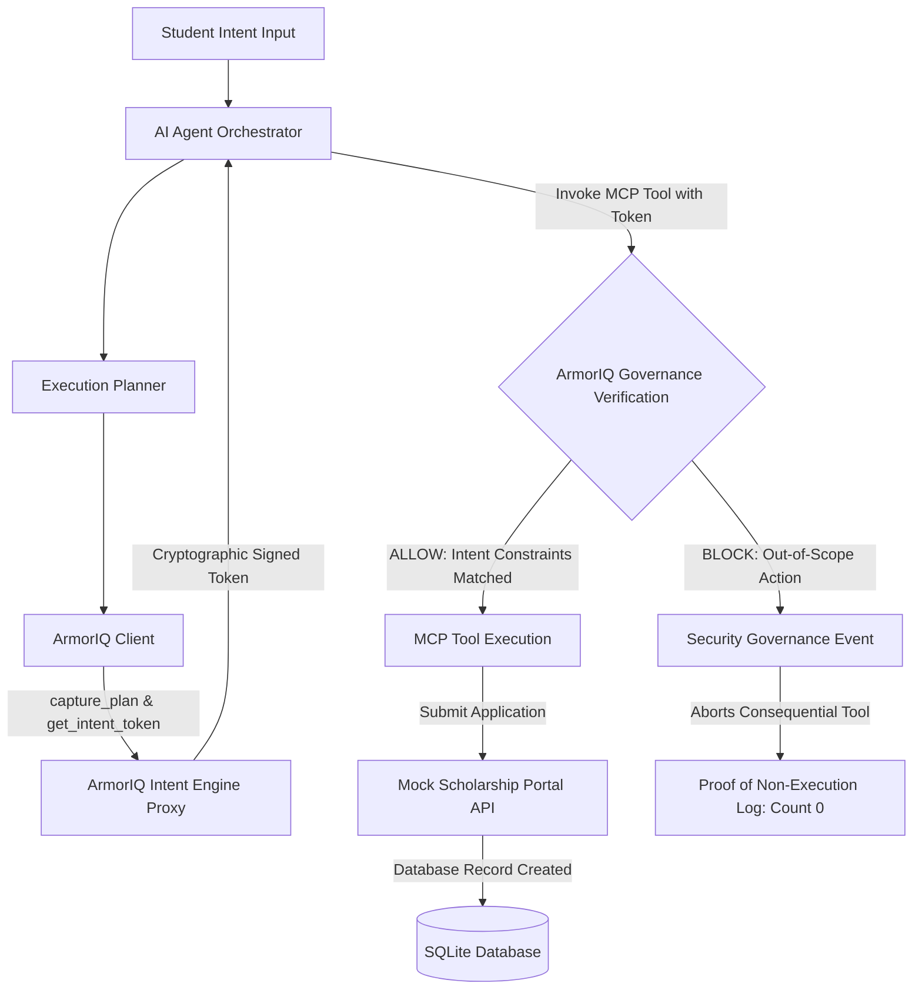

# ScholarShield — Intent-Governed Autonomous Scholarship Application Agent

> **Automate India Hackathon — ArmorIQ Track**  
> *Core Engineering Principle: AI should be autonomous in execution, but not autonomous in authority.*

---

## 📌 Executive Summary
**ScholarShield** is an autonomous scholarship application agent governed by **ArmorIQ Intent Engine**. It automates scholarship discovery, eligibility verification, document preparation, and form submission for students, while enforcing cryptographic intent boundaries to prevent unauthorized actions or agent scope drift.

---

## 🎯 Real-World Problem
Students face a fragmented, repetitive scholarship application workflow across multiple portals. While AI agents can automate this workflow, **unconstrained AI autonomy creates an authority crisis**. 

If a student instructs an agent:  
*"Find government engineering scholarships in Punjab I am eligible for and apply."*

An autonomous agent might reason:  
*"Applying to this private foundation grant will maximize the student's financial aid."*

Even if well-intentioned, **the student never authorized that action**. AI agents can reason freely, but **they cannot manufacture authority**.

---

## 🛡️ How ArmorIQ Solves the Authority Crisis
ArmorIQ sits directly in the authorization execution path between the agent's plan and MCP tool execution:



1. **Intent Binding**: Student prompt and constraints (`scholarship_type: government`, `state: Punjab`) are captured via ArmorIQ `capture_plan`.
2. **Cryptographic Intent Tokens**: ArmorIQ issues a signed token containing plan constraints.
3. **Governed Invocation**: Prior to calling `submit_application`, ArmorIQ checks target parameters.
4. **Fail-Closed Non-Execution**: If an out-of-scope action is attempted, ArmorIQ returns `BLOCK` / `IntentMismatchException`. The tool call is aborted, and submission count in the database remains **0**.

---

## 📂 Repository Structure
```text
D:\armor-iq-scholarship-agent\
├── .env.example
├── .gitignore
├── README.md
├── requirements.txt
├── app/
│   ├── main.py                     # Main FastAPI Agent Server
│   ├── agent/
│   │   ├── models.py               # Student Intent & Plan models
│   │   ├── orchestrator.py         # Autonomous workflow executor
│   │   └── planner.py              # Execution plan generator
│   ├── armoriq/
│   │   ├── client.py               # ArmorIQ SDK client & governance engine
│   │   └── errors.py               # SDK exception hierarchy
│   ├── tools/
│   │   ├── mcp_server.py           # MCP Server integration
│   │   └── scholarship_tools.py    # MCP Scholarship tool wrappers
│   ├── scholarship/
│   │   ├── models.py               # Domain schemas
│   │   └── service.py              # Core service layer
│   └── config/
│       └── settings.py
├── mock_portal/
│   ├── database.py                 # SQLite setup & synthetic data
│   ├── routes.py                   # Mock scholarship portal API
│   └── main.py                     # Mock portal FastAPI server
├── frontend/
│   ├── index.html                  # Dashboard HTML
│   ├── styles.css                  # Modern dark mode styling
│   └── app.js                      # Live execution UI script
├── policies/
│   └── armoriq.yaml                # ArmorIQ YAML policy definition
├── tests/
│   ├── test_scholarships.py        # Domain unit tests
│   ├── test_armoriq_governance.py  # ArmorIQ governance tests
│   └── test_security_non_execution.py # Security non-execution assertions
└── docs/
    ├── architecture.md
    ├── problem.md
    ├── threat-model.md
    ├── armoriq.md
    └── setup.md
```

---

## 🛠️ Technology Stack
- **Backend & API**: Python 3.14 / 3.10+, FastAPI, Uvicorn, Pydantic v2
- **Governance & Security**: `armoriq-sdk` (ArmorIQ Intent Token Engine)
- **Protocol**: Model Context Protocol (MCP) Tool Architecture
- **Database**: SQLite with synthetic student & scholarship data
- **Testing**: `pytest`, `pytest-asyncio`
- **Frontend**: Vanilla HTML5, Modern CSS3 (Dark Glassmorphism), JavaScript (ES6)

---

## 🚀 Quickstart & Reproduction Guide

### 1. Environment Setup
```powershell
cd D:\armor-iq-scholarship-agent
$env:TEMP='D:\tmp'; $env:TMP='D:\tmp'
python -m venv .venv
.venv\Scripts\activate
pip install -r requirements.txt
Copy-Item .env.example .env
```

### 2. Start Mock Scholarship Portal
```powershell
$env:PYTHONPATH='D:\armor-iq-scholarship-agent'
.venv\Scripts\python.exe -m uvicorn mock_portal.main:app --host 127.0.0.1 --port 8001
```

### 3. Start Agent Backend Service
```powershell
$env:PYTHONPATH='D:\armor-iq-scholarship-agent'
.venv\Scripts\python.exe -m uvicorn app.main:app --host 127.0.0.1 --port 8000
```

### 4. Open Frontend Dashboard
Open `D:\armor-iq-scholarship-agent\frontend\index.html` in any web browser.

---

## 🧪 Running Automated Tests

Run the complete test suite including security non-execution assertions:
```powershell
$env:PYTHONPATH='D:\armor-iq-scholarship-agent'
.venv\Scripts\pytest.exe -v
```

### Expected Output:
```text
tests/test_armoriq_governance.py::test_armoriq_plan_capture_and_token_minting PASSED
tests/test_armoriq_governance.py::test_armoriq_authorized_action_allow PASSED
tests/test_armoriq_governance.py::test_armoriq_out_of_scope_action_block PASSED
tests/test_scholarships.py::test_scholarship_listing_and_filtering PASSED
tests/test_scholarships.py::test_student_eligibility_positive PASSED
tests/test_scholarships.py::test_student_eligibility_state_mismatch PASSED
tests/test_security_non_execution.py::test_proof_of_non_execution_when_blocked_by_armoriq PASSED

7 passed in 1.89s
```

---

## 🔒 Security Proof: Proof of Non-Execution
The security test verifies **two distinct assertions**:
1. ArmorIQ Decision: `BLOCK` (`IntentMismatchException`).
2. Underlying Tool Execution: `executed == 0` and database submission count for the unauthorized scholarship remains strictly **0**.

---

## 📜 License
MIT License. Built for Automate India Hackathon 2026.
