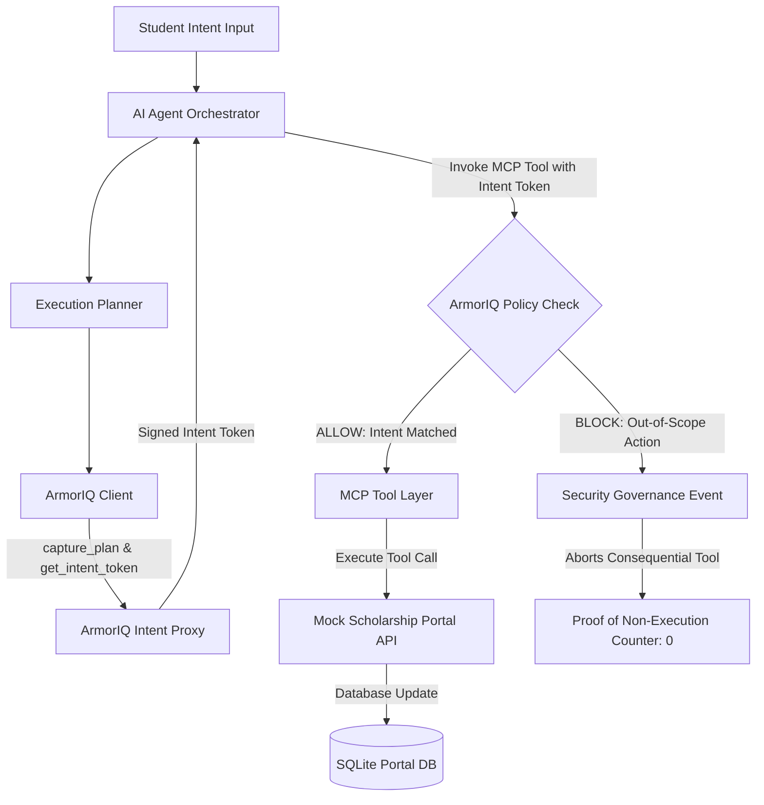

# System Architecture

## Overview Architecture

## Component Boundaries & Trust Model
1. **User Identity & Intent Boundary**: Student inputs natural language prompt + structured constraints (`scholarship_type: government`, `state: Punjab`).
2. **Planning & Token Boundary**: Planner creates step-by-step actions. ArmorIQ `capture_plan` and `get_intent_token` lock constraints into a signed cryptographic token.
3. **Governance Proxy Boundary**: Prior to invoking any MCP tool, `ArmorIQClient.invoke` checks the target action and parameters against the token's constraints.
4. **Tool Execution Boundary**: Consequential actions like `submit_application` check ArmorIQ decision. If `BLOCK`, execution is aborted and non-execution is logged in audit records.
